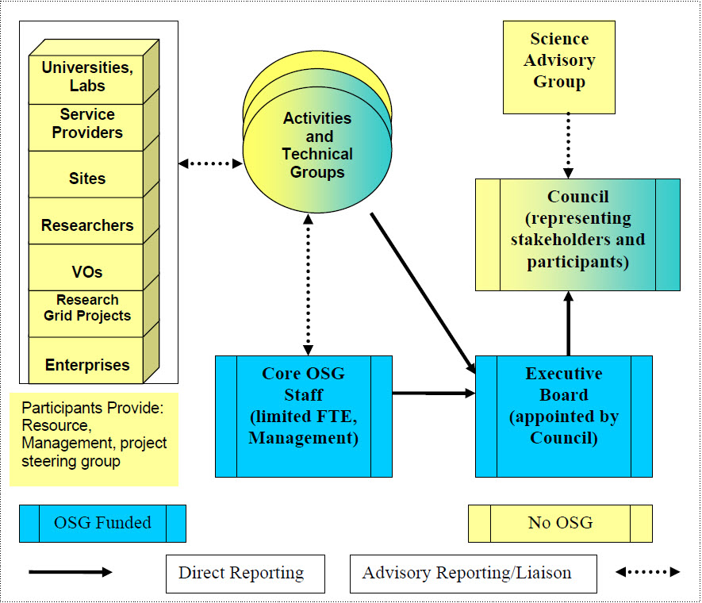

Open Science Grid By-laws
=========================

> **2015 version (now defunct)**

### Purpose

The Open Science Grid Consortium is a consortium of scientific collaborations, scientific computing centers and existing and new grid research and deployment projects, involving both computational and application scientists, working together to provide and support the set of facilities, services and infrastructure needed to provide a persistent national grid infrastructure for large scale US science: the Open Science Grid.

### Organizational Structure of the Open Science Consortium

The governing bodies of the OSG Consortium are the OSG Council and the OSG Executive Board. The organizational structure is depicted in Figure 1.

**Figure 1.**

The OSG Council is the governing body of the Consortium. The OSG Council provides the scientific coordination and oversight of OSG activities. The OSG Council shall self select a chair to lead the council. The term for the Chair shall be two years. Individuals can serve no more than two full consecutive terms as chair.

The Scientific Advisory Group periodically reviews OSG activities and advises the OSG Council on matters related to OSG. The SAG may include leaders of scientific projects using the OSG and leaders in the area of distributed computing. The SAG members are appointed by the OSG Council Chair with input from the Council and the Executive Team.

The OSG Council elects an Executive Director to manage programmatic activities with the help of an Executive Team. The Executive Director appoints an Executive Board to direct the OSG program of work, draw up policies and represent the OSG Consortium in dealing with other organizations and committees.

All appointments to the Executive Board are subject to council approval. Details of the OSG program of work are in the [OSG Management Plan](http://osg-docdb.opensciencegrid.org/cgi-bin/ShowDocument?docid=314) (<http://osg-docdb.opensciencegrid.org/cgi-bin/ShowDocument?docid=314>)

Users of and providers to the OSG are not required to be affiliated with OSG member organizations.

### Membership of the OSG Council

Membership in the OSG Consortium does not imply membership on the OSG Council. The OSG council represents the organizations that comprise the OSG Consortium. The Council Membership shall not exceed 30 voting members. At least two voting slots will be held for council members at large to represent OSG Consortium members who do not have direct representation on the council. At large representatives will have a term of two years.

OSG Consortium Membership occurs through completed registration of a resource, VO, or other organization with the OSG through the Operations Registration process. OSG Consortium Members contribute to and/or benefit directly from the resources, use, operations and/ or other activities of the OSG.

OSG Consortium Partners collaborate with the OSG as peer organizations. Their representatives have ex-officio status on any of the management boards in which they participate. The OSG Executive Board develops agreements with the management of the partner organizations to define the expectations and activities of the collaboration.

New organizations may apply for membership in the OSG council if supported by at least one existing member organization in the OSG council. The proposal for participation is submitted to the OSG Council Chair. The Chair will consult with the Exec Board and the EB will make a recommendation to the Council concerning the application The OSG council formally votes on the acceptance of new member organizations to the Council in a timely and appropriate manner.

The Council has the ability to appoint non-voting liaisons and partnership representatives to participate in the council.

#### Alternates, proxies and attendance requirements

It is the intention that OSG Council members actively participate in Council and Consortium activities on a regular basis. Activities include teleconference, video conferences, face to face meetings, email voting, contributing to the work of the council, etc. A regular basis defined as participation in at least half of the council events a 6 month period.

OSG Council members can send alternates to meetings and activities occasionally, but this is not considered actively participating. Alternates are allowed to represent their respective organizations and, if empowered, vote via proxy.

OSG Council member can provide a voting proxy to another council member or an alternate by contacting the OSG Council Chair and informing the chair who has the member's proxy. Proxies are temporary and last for the length of a single activity (meeting, electronic vote, etc).

For the sake of votes, 1/5 of the membership is considered a quorum as long as the vote is announced in advanced.

### Membership in the OSG Executive Board

The OSG Executive Board is comprised of an Executive Director, and Executive Team and other members. The Executive Board directs the OSG program of work and draws up policies. The OSG Executive Board speaks for the OSG consortium and represents the OSG Consortium in dealing with other organizations and committees.

### Establishment of bylaws:

The bylaws and [charter](http://osg-docdb.opensciencegrid.org/cgi-bin/ShowDocument?docid=25) (<http://osg-docdb.opensciencegrid.org/cgi-bin/ShowDocument?docid=25>) are accepted by majority vote according the [OSG Voting Rules](http://osg-docdb.opensciencegrid.org/cgi-bin/ShowDocument?docid=311) (<http://osg-docdb.opensciencegrid.org/cgi-bin/ShowDocument?docid=311>) as approved at the time of the vote. The initial bylaws and charter were accepted by consensus.

### Amendment of bylaws or charter

(1) An amendment to the bylaws or charter can be proposed by any member of the Executive Board and OSG Council.

(2) A proposed amendment is then accepted according the OSG Voting Rules (document 311) as approved at the time of the vote.

#### Change History

V1.0.1 March 10, 2005, fkw, Added D. Olson to exec. Board as of Feb.9 2005

V1.0 Feb. 18, 2005, fkw, TG-Governance ratified text

V1.0.3 Aug. 24, 2005, wtck, Updates based on funding agreements and other originating documents.

-   Added Purpose
-   Define the Executive Team
-   Define Council Membership
-   Define participation expectations, alternates, proxies\*
-   Define high level responsibilities
-   Deleted member lists - will be posted on the web

